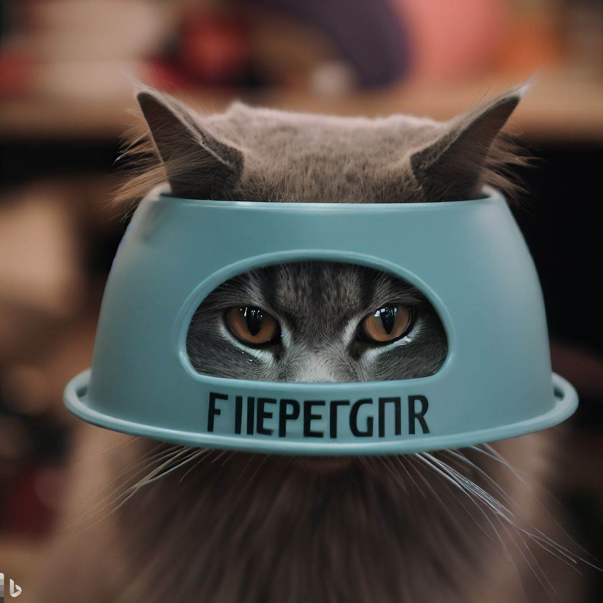
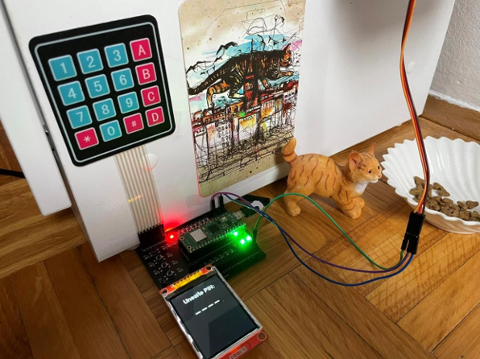

<!-- PROJECT LOGO -->
 

  

  <h3 align="center">Cat feeder</h3>

  

    Embbeded application for feeding cats
     
    <a href="https://github.com/mkulovac1/catFeederUS/documentation"><strong>Explore the docs »</strong></a>
     
     
    <a href="https://www.youtube.com/watch?v=bjHLFyO3lvw&ab_channel=Ugradbenisistemi2023">View Demo</a>
    ·
    <a href="https://github.com/mkulovac1/catFeederUS/issues">Report Bug</a>
  

<!-- ABOUT THE PROJECT -->
## About The Project

  

  Catfeeder is an application that helps when we are feeding cats. It is an embedded application that was implemented on the Raspberry Pi Pico development system with additional components such as a display, 
  keyboard and motor. With the help of the keyboard, we enter the pin used for identity verification. 
  If the pin is correct, the opening in the box opens with the help of a servo motor and food falls out of food container into cat bowl. 
  The entire procedure can be followed on the display, which shows the pin entry and whether or not we have successfully entered the given pin.

(<a href="#readme-top">back to top</a>)

## Demo

You can see a demo of this application on the following link: [CLICK ME](https://www.youtube.com/watch?v=bjHLFyO3lvw&ab_channel=Ugradbenisistemi2023)

(<a href="#readme-top">back to top</a>)

## Built With

* Python
* Raspberry Pi Pico
* Matrix keyboard 4x4
* Servo motor SG90
* TFT ST7735 display
* MQTT

(<a href="#readme-top">back to top</a>)

<!-- GETTING STARTED -->
## Getting Started

To replicate this project you need the following:
* An IDE that supports the Python programming language
* Raspberry Pi Pico as development system
* Matrix keyboard 4x4
* Servo motor SG90
* TFT ST7735 display
* MQTT for controlling app via mobile phone
* Food container
* Cat bowl

### Installation

* Connect the components in the way shown in the scheme on the following link: [CLICK ME](https://github.com/mkulovac1/catFeederUS/tree/main/documentation/schema)

(<a href="#readme-top">back to top</a>)

<!-- USAGE EXAMPLES -->
## Usage

You can see how to use the application on the demo we provided above or by clicking on the following link: [CLICK ME](https://github.com/mkulovac1/catFeederUS/tree/main/documentation/userInstructions)

(<a href="#readme-top">back to top</a>)

<!-- CONTRIBUTING -->
## Contributing

Contributions are what make the open source community such an amazing place to learn, inspire, and create. Any contributions you make are **greatly appreciated**.

If you have a suggestion that would make this better, please fork the repo and create a pull request. You can also simply open an issue with the tag "enhancement".
Don't forget to give the project a star! Thanks again!

1. Fork the Project
2. Create your Feature Branch (`git checkout -b feature/AmazingFeature`)
3. Commit your Changes (`git commit -m 'Add some AmazingFeature'`)
4. Push to the Branch (`git push origin feature/AmazingFeature`)
5. Open a Pull Request

(<a href="#readme-top">back to top</a>)

<!-- CONTACT -->
## Contact

Merim Kulovac, [@merimkulovac](https://www.linkedin.com/in/merimkulovac/), e-mail: merim.kulovac@outlook.com

(<a href="#readme-top">back to top</a>)

